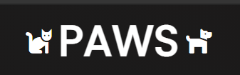

# 
[:dog:Pet Store :cat: ](https://pet-store-three.vercel.app/)

---

  

  

---

> Personal project to learn react and deployment

## About

<b>
A place for all your pet needs.
</b>

Store has options to adopt pets(cats or dogs) or buy products for your pets.

## Installation

In the root folder run `yarn` to download all dependencies

## Usage

Run server

- `yarn start`

## Working app

## Concepts learned:

- [x] React
- [x] React routing
- [x] Reusing components
- [x] Deployment using vercel

## Task list

- [ ] Make responsive
- [ ] Improve design
- [ ] Extend the contact pages
